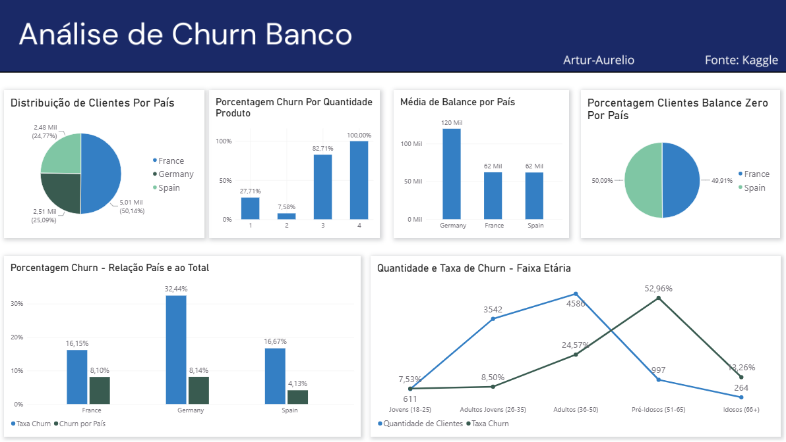

# Análise de Corte Transversal — Churn de Clientes Bancários

## 1. RESUMO TÉCNICO

Foi realizada uma análise estatística de um conjunto de dados contendo **10.000 clientes de um banco internacional**, distribuídos entre França, Alemanha e Espanha, com o objetivo de identificar padrões associados ao **churn de clientes**.

Entre os principais padrões identificados, destacam-se:

* **Alemanha:** apresentou a maior taxa de churn, onde, dos 2.037 clientes que saíram do banco, 814 eram alemães (8.14% da base total).
* **Faixa etária:** foram observadas diferenças expressivas nas taxas de churn entre as faixas etárias, com destaque para os clientes entre **51 e 65 anos**, que apresentaram taxa de **52,96%**.
* **Clientes jovens:** apresentaram algumas das menores taxas de churn, com **7,53%** entre 18 e 25 anos e **8,50%** entre 26 e 35 anos.
* **Quantidade de produtos:** clientes com 3 e 4 produtos apresentaram taxas excepcionalmente altas de churn, de **82,71%** e **100%**, respectivamente. Entretanto, esses grupos possuem populações reduzidas, com 266 e 60 clientes.
* **Saldo:** foram observadas diferenças relevantes na distribuição dos saldos entre os países, principalmente devido à elevada quantidade de clientes com saldo zero na França e na Espanha.

**Próximas investigações**

* Investigar se existem diferenças na experiência de uso da plataforma entre clientes de diferentes faixas etárias e nacionalidades.
* Comparar o desempenho e as condições oferecidas pelo banco com outras instituições dos mercados analisados.
* Investigar quais características estão associadas aos clientes que possuem 3 ou 4 produtos, devido às taxas de churn excepcionalmente elevadas observadas nesses grupos.

## 2. CONTEXTO

Os dados utilizados correspondem a uma amostra obtida a partir de um corte transversal de clientes de um banco internacional. A base contém **10.000 clientes**, pertencentes a um dos três países analisados: **França, Alemanha e Espanha**.

A distribuição dos clientes entre os países não é uniforme. A França concentra aproximadamente **50% dos clientes (5.000)**, enquanto Alemanha e Espanha possuem aproximadamente **25% cada (2.500)**.

O objetivo da análise foi investigar a **taxa de churn** dos clientes e identificar possíveis padrões ou comportamentos relevantes entre diferentes grupos da população.

## 3. PRINCIPAIS ACHADOS

### **Aproximadamente metade dos clientes franceses e espanhóis possuem saldo zero, enquanto não foram identificados clientes alemães com saldo zero.**

* A presença de uma grande quantidade de saldos iguais a zero influencia significativamente as estatísticas de saldo da França e da Espanha.
* A Alemanha apresenta o maior saldo médio, de aproximadamente **120 mil**, enquanto França e Espanha apresentam valores semelhantes e menores, de aproximadamente **62 mil**.
* Portanto, a comparação entre os países deve considerar a distribuição dos valores de saldo, e não apenas a média.

### **32,4% dos clientes alemães (n = 814) saíram do banco.**

* A Alemanha apresenta a maior taxa de churn entre os três países, com **32,4%**, enquanto França e Espanha apresentam taxas de **16,15%** e **16,67%**, respectivamente.
* Dos **2.037 clientes que saíram do banco**, 814 eram alemães, 810 eram franceses e 413 eram espanhóis.
* Considerando a base completa de 10.000 clientes, os clientes alemães que saíram representam **8,14% da base total**, os franceses representam **8,10%** e os espanhóis **4,13%**.

### **Determinadas faixas etárias apresentam taxas de churn mais elevadas.**

* A taxa de churn varia consideravelmente entre as diferentes faixas etárias.
* A faixa de **adultos (36–50 anos)** possui 4.586 clientes e apresenta uma taxa de churn de **24,57%**.
* A faixa de **pré-idosos (51–65 anos)** possui 997 clientes e apresenta a maior taxa de churn observada, de **52,96%**.
* A faixa de **idosos (66 anos ou mais)** possui 264 clientes e apresenta uma taxa de churn de **13,26%**.
* Dessa forma, embora exista uma relação aparente entre idade e churn, o comportamento não é simplesmente crescente com a idade, sendo necessário considerar as características específicas de cada faixa etária.

### **Clientes mais jovens apresentam baixas taxas de churn.**

* As categorias de **jovens (18–25 anos)** e **adultos jovens (26–35 anos)** apresentam algumas das menores taxas de churn da base.
* A faixa de jovens possui 611 clientes e apresenta uma taxa de churn de **7,53%**.
* A faixa de adultos jovens possui 3.542 clientes e apresenta uma taxa de churn de **8,50%**.

### **Clientes com 3 ou 4 produtos apresentam taxas de churn excepcionalmente altas.**

* Clientes com **1 e 2 produtos** (5 mil clientes e 4.5 mil clientes respectivamente) apresentam taxas de churn de **27,71%** e **7,58%**, respectivamente.
* Em contraste, clientes com **3 ou 4 produtos** apresentam taxas de churn de **82,71%** e **100%**, respectivamente.
* Entretanto, esses resultados devem ser interpretados com cautela, pois esses grupos representam uma pequena parcela da população: **266 clientes possuem 3 produtos e apenas 60 possuem 4 produtos**.
* Dessa forma, apesar da diferença expressiva nas taxas de churn, o tamanho reduzido dessas populações limita a possibilidade de generalizar esse comportamento para toda a base.

## 4. POSSÍVEIS EXPLICAÇÕES

Os fatores apresentados nesta seção são **hipóteses levantadas a partir dos padrões observados nos dados**. O dataset analisado não possui informações suficientes para confirmar diretamente essas possíveis causas.

### **Maior churn em determinadas faixas etárias**

* A plataforma do banco pode apresentar características de usabilidade ou acessibilidade menos adequadas para determinados grupos etários.
* Clientes de determinadas faixas etárias podem possuir necessidades financeiras diferentes e, consequentemente, maior propensão a buscar outros serviços bancários.

### **Maior churn entre clientes alemães**

* O banco pode apresentar diferenças na experiência ou no suporte oferecido aos clientes alemães.
* Características específicas do mercado bancário alemão podem tornar outras instituições mais atrativas para determinados clientes.
* Também podem existir diferenças socioeconômicas ou comportamentais entre os países que não estão contempladas no dataset.

### **Maior churn entre clientes com 3 ou 4 produtos**

* A manutenção de múltiplos produtos pode estar associada a custos ou condições menos vantajosas para determinados clientes.
* Clientes com maior quantidade de produtos podem possuir um perfil diferente dos demais, o que poderia explicar parte da diferença observada.

**São necessárias informações adicionais para verificar essas hipóteses e determinar possíveis relações causais.**

## 5. DETALHAMENTO TÉCNICO

### **5.1 Análises descritivas**

Para a análise descritiva dos dados, tanto de forma agregada quanto segmentada, foram calculadas medidas como **média, desvio padrão, coeficiente de variação, assimetria e curtose**.

Essas medidas foram utilizadas para compreender a distribuição das variáveis e identificar possíveis diferenças entre os grupos analisados.

### **5.2 Análises inferenciais**

Para avaliar a normalidade dos dados e a homogeneidade das variâncias, foram utilizados, respectivamente, os testes de **Shapiro-Wilk** e **Levene**, adotando-se um nível de significância de **0,05 (5%)**.

De forma geral, as análises seguiram o seguinte procedimento:

1. **Verificação da normalidade:** aplicação do teste de Shapiro-Wilk para avaliar se os dados apresentavam distribuição normal.

2. **Verificação da homogeneidade das variâncias:** aplicação do teste de Levene para avaliar se as variâncias dos grupos poderiam ser consideradas homogêneas.

3. **Comparação entre grupos:** diante da ausência de normalidade observada na maioria das análises e considerando as características das variâncias, foi utilizado o **teste ANOVA de Welch** para verificar se existiam diferenças estatisticamente significativas entre as médias dos grupos.

4. **Análise post hoc:** quando identificadas diferenças significativas, foi utilizado o teste **Games-Howell** para realizar comparações par a par e identificar quais grupos apresentavam diferenças estatisticamente significativas entre si.

## 6. DASHBOARD
Foi criado um dashboard no Power BI para apresentar, de forma visual e interativa, os principais resultados encontrados ao longo da análise.

O dashboard reúne informações relacionadas à taxa de churn, distribuição por país, faixas etárias, quantidade de produtos e saldo dos clientes, permitindo uma visualização mais clara dos padrões identificados.

  

