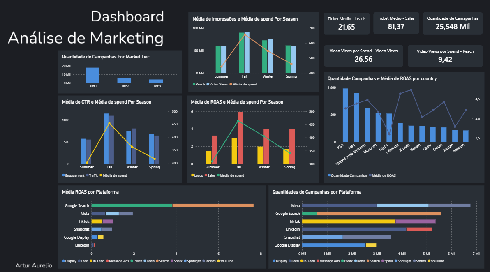

# Análise do Desempenho de Campanhas de Marketing

## 1. Contexto

Uma empresa fictícia de marketing deseja compreender o desempenho de suas campanhas publicitárias e identificar padrões que possam auxiliar na tomada de decisões. Para isso, foi solicitada uma análise de métricas como CPC, CPA, ROAS, CTR, entre outras, com foco nas seguintes questões de negócio:

- Como as campanhas estão distribuídas entre plataformas e placements?
- Quais plataformas e placements apresentam melhor desempenho em ROAS?
- Como as campanhas e seus resultados se distribuem entre os países?
- Em quais períodos do ano há maior investimento e volume de impressões? Como o ROAS se comporta nesses períodos?
- Qual é o ticket médio das campanhas voltadas para conversão?

O dataset utilizado possui aproximadamente **30 mil linhas e 41 colunas**. Entre as principais variáveis categóricas analisadas estão país, plataforma, placement e estação do ano.

Para facilitar a análise, os dados foram separados em três conjuntos, de acordo com a etapa do funil de marketing: **Awareness, Consideration e Conversion**.

## 2. Etapas da Análise

Para responder às questões de negócio propostas, foram realizadas as seguintes etapas:

- Conversão dos tipos de dados para facilitar as análises.
- Identificação e tratamento de valores nulos e vazios.
- Criação e validação de métricas de desempenho, como CTR, ROAS e CPA.
- Análise exploratória e criação de gráficos utilizando Python.
- Registro dos principais resultados e identificação de padrões relevantes.
- Limpeza e preparação dos dados para exportação ao Power BI.
- Desenvolvimento de gráficos e visualizações no Power BI.

## 3. Principais Insights

Os principais resultados identificados durante a análise foram:

- **Desempenho por plataforma:** as campanhas veiculadas no Google Search apresentaram os maiores valores médios de ROAS entre as plataformas e placements analisados, apesar de a plataforma ocupar a segunda posição em número de campanhas.

- **Sazonalidade:** entre setembro e novembro (*Fall*), foram observados aumentos nos indicadores de investimento, impressões, CTR e ROAS, sugerindo um período de maior atividade e desempenho das campanhas.

- **Desempenho das campanhas de conversão:** campanhas com foco em Leads apresentaram maior volume médio de conversões, enquanto campanhas com foco em Sales obtiveram maior ROAS e ticket médio. Isso demonstra que o maior número de conversões não necessariamente corresponde ao maior retorno financeiro.

- **Desempenho das campanhas de consideração:** campanhas com foco em Engagement e Traffic apresentaram resultados semelhantes nas métricas analisadas. Já entre os objetivos de Awareness, as campanhas de Video Views geraram aproximadamente 26 visualizações por unidade monetária investida, contra cerca de 9 nas campanhas de Reach.

## 4. Dashboard

Foi desenvolvido um dashboard no Power BI para apresentar visualmente os principais resultados encontrados ao longo da análise.

  

